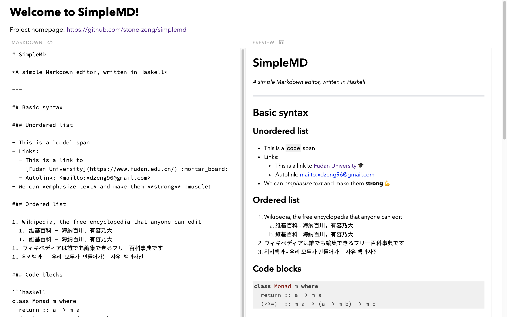

# SimpleMD

A simple Markdown editor, written in Haskell

## Demo



## Build & run

```sh
cabal new-run simplemd
```

## License

Copyright (C) 2019, 2020 by Xiangdong Zeng & Xuyang Duan.

Licensed under the MIT License.
